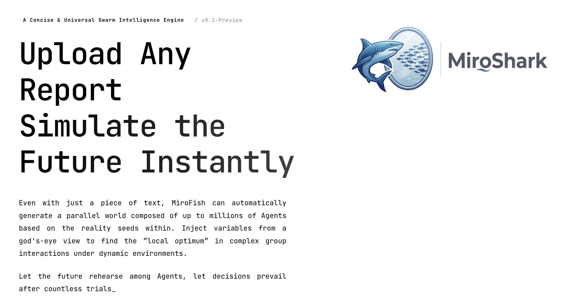
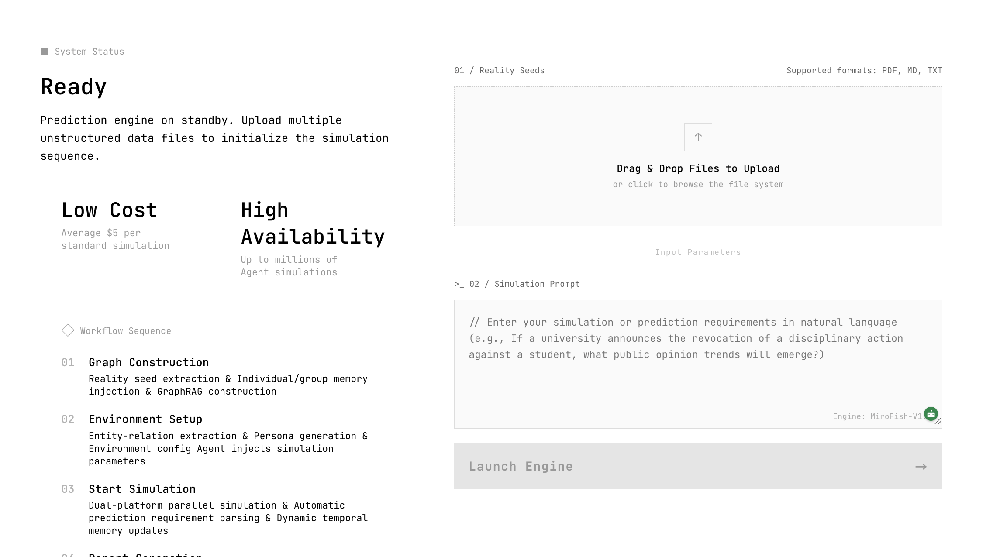

<div align="center">


<em>A Simple and Universal Swarm Intelligence Engine, Predicting Anything</em>

</div>

## ⚡ Project Overview

**MiroShark** is a next-generation AI prediction engine powered by multi-agent technology. By extracting seed information from the real world (such as breaking news, policy drafts, and financial signals), it automatically constructs a high-fidelity parallel digital world. Within this space, thousands of agents — each with independent personalities, long-term memory, and behavioral logic — interact freely and undergo social evolution. You can dynamically inject variables from a "God's-eye view" to precisely simulate future trajectories — **letting the future rehearse in a digital sandbox, so decisions can prevail after hundreds of simulated battles**.

> All you need to do: upload seed materials (data analysis reports or interesting novel stories) and describe your prediction requirements in natural language</br>
> MiroShark will return: a detailed prediction report and a high-fidelity digital world you can deeply interact with

### Our Vision

MiroShark is dedicated to building a swarm intelligence mirror that maps reality. By capturing the emergent behaviors that arise from individual interactions, it breaks through the limitations of traditional prediction:

- **At the macro level**: We are a rehearsal laboratory for decision-makers, allowing policies and public relations strategies to be tested in a zero-risk environment
- **At the micro level**: We are a creative sandbox for individual users — whether deducing a novel's ending or exploring imaginative scenarios, it's fun, playful, and accessible

From serious prediction to entertaining simulation, we make every "what if" visible, making it possible to predict anything.

## 📸 Screenshots

<div align="center">

<br/><br/>

<br/><br/>

</div>

## 🔄 Workflow

1. **Knowledge Graph Construction**: Real-world seed extraction & individual and collective memory injection & GraphRAG construction
2. **Environment Setup**: Entity-relationship extraction & persona generation & environment configuration agent injects simulation parameters
3. **Start Simulation**: Dual-platform parallel simulation & automatic parsing of prediction requirements & dynamic updating of temporal memory
4. **Report Generation**: ReportAgent has a rich set of tools to deeply interact with the post-simulation environment
5. **Deep Interaction**: Chat with any individual in the simulated world & chat with the ReportAgent

## 🚀 Quick Start

### Option 1: Source Code Deployment (Recommended)

#### Prerequisites

| Tool | Version Requirement | Description | Installation Check |
|------|---------|------|---------|
| **Node.js** | 18+ | Frontend runtime environment, includes npm | `node -v` |
| **Python** | >=3.11, <=3.12 | Backend runtime environment | `python --version` |
| **uv** | Latest | Python package manager | `uv --version` |

#### 1. Configure Environment Variables

```bash
# Copy the example configuration file
cp .env.example .env

# Edit the .env file and fill in the required API keys
```

**Required environment variables:**

```env
# LLM API Configuration (supports any LLM API compatible with the OpenAI SDK format)
# Recommended: Alibaba Cloud Bailian platform qwen-plus model: https://bailian.console.aliyun.com/
# Note: consumption can be significant; try running simulations with fewer than 40 rounds first
LLM_API_KEY=your_api_key
LLM_BASE_URL=https://dashscope.aliyuncs.com/compatible-mode/v1
LLM_MODEL_NAME=qwen-plus

# Zep Cloud Configuration
# The free monthly quota is sufficient for basic usage: https://app.getzep.com/
ZEP_API_KEY=your_zep_api_key
```

#### 2. Install Dependencies

```bash
# One-click install all dependencies (root + frontend + backend)
npm run setup:all
```

Or install step by step:

```bash
# Install Node dependencies (root + frontend)
npm run setup

# Install Python dependencies (backend, automatically creates virtual environment)
npm run setup:backend
```

#### 3. Start Services

```bash
# Start both frontend and backend simultaneously (run from project root)
npm run dev
```

**Service addresses:**
- Frontend: `http://localhost:3000`
- Backend API: `http://localhost:5001`

**Start individually:**

```bash
npm run backend   # Start backend only
npm run frontend  # Start frontend only
```

### Option 2: Docker Deployment

```bash
# 1. Configure environment variables (same as source code deployment)
cp .env.example .env

# 2. Pull images and start
docker compose up -d
```

By default, it reads the `.env` file from the root directory and maps ports `3000 (frontend) / 5001 (backend)`

> Accelerated mirror addresses are provided as comments in `docker-compose.yml` and can be substituted as needed

## 📄 Acknowledgments

Built on top of [MiroFish](https://github.com/666ghj/MiroFish) — thanks to the original authors for the foundation.

MiroShark's simulation engine is powered by **[OASIS](https://github.com/camel-ai/oasis)**. We sincerely thank the CAMEL-AI team for their open-source contributions!
